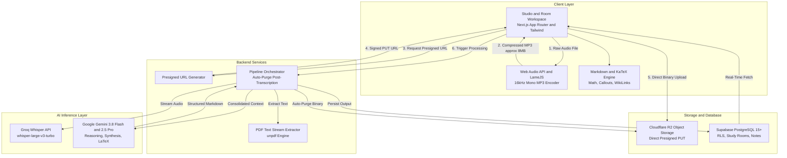

# SynapseVault

> High-performance collaborative academic ingestion engine and study space. Synthesizes university lecture audio streams, slide decks, syllabi, and group project specifications into structured, cross-linked Obsidian Markdown graphs.

---

## Overview

**SynapseVault** bridges the gap between chaotic university classroom material and structured, long-term knowledge retention. It combines a decoupled zero-cost audio/PDF ingestion pipeline with a real-time collaborative workspace ("Multiplayer NotebookLM") designed specifically for academic semesters.

Students can ingest multi-hour lecture recordings and slide decks to generate Obsidian-native Markdown notes equipped with LaTeX formulas, semantic callouts, and concept wikilinks, while collaborating in shared study rooms with live project scratchpads and living AI syntheses.

---

## Core Capabilities

### 1. High-Performance Decoupled Ingestion Pipeline
* **Client-Side Audio Compression:** Employs the Web Audio API and LameJS to decode, downsample (to 16kHz mono), and quantize audio directly in the browser. Reduces multi-hour lecture files from $>80\text{ MB}$ to $<8\text{ MB}$ prior to upload, drastically minimizing bandwidth usage and eliminating server CPU bottlenecks.
* **Direct-to-Storage Ingestion:** Audio streams upload directly to Cloudflare R2 via presigned URLs, bypassing API payload ceilings and serverless timeouts.
* **Zero-Cost Storage Footprint:** Ephemeral audio binaries are automatically purged from R2 immediately following transcription, ensuring persistent storage remains at $0.00\text{ MB}$.
* **Decoupled AI Pipeline:** Transcribes audio rapidly with Groq Whisper (`whisper-large-v3-turbo`) and offloads mathematical reasoning and note structuring to Google Gemini (3.8 Flash / 2.5 Pro).
* **Direct Slide Text Extraction:** Parses digital slide text from PDF files via `unpdf` without converting pages to heavy vision bitmaps.

### 2. Collaborative Study Rooms ("Multiplayer NotebookLM")
* **Multi-User Academic Workspaces:** Secure shared spaces for class cohorts, backed by Supabase PostgreSQL with Row-Level Security (RLS) and email whitelist protection.
* **Hierarchical Course Organization:** Nested academic tree structure: **Year (1º/2º/3º Ano) $\rightarrow$ Semester (1º/2º Semestre) $\rightarrow$ Course $\rightarrow$ Subfolders (Teóricas, Group Projects, Weekly Lectures)**.
* **Session Persistence:** Sidebar drag-resizing and folder collapse/expansion states persist across sessions in `localStorage`.
* **Deep Navigation Memory:** Automatically restores active folder, selected tabs, and tree hierarchy when reloading (`Ctrl + R`) or sharing links.

### 3. Study Hub & Syllabus AI Synthesizer
* **Course Home Page Generation:** Automatically extracts institutional syllabi and course PDFs into a structured course portal highlighting evaluation dates, grading rules, and lecture roadmaps.
* **Smart Weekly Ingestion:** Detects lecture patterns in note titles ("Semana 1", "Aula 02") and routes imported files into corresponding weekly directories automatically.
* **Weeks Directory & Lecture Archive:** Browse materials by chronological semester week or view all imported class notes in an interactive card grid.

### 4. Living Master Notes & Interactive Visualizer
* **Living Master Note Synthesis:** Compounding incremental synthesis engine that combines all lecture notes within a folder into a cohesive master document.
* **Real-Time Auto-Save:** Debounced background synchronization for manual edits with live status indicators.
* **Advanced Markdown & KaTeX Engine:**
  - Full LaTeX math rendering for inline (`$...$`) and display blocks (`$$...$$`) via KaTeX.
  - Native GitHub & Obsidian callouts (`> [!NOTE]`, `> [!TIP]`, `> [!IMPORTANT]`, `> [!WARNING]`, etc.) with dedicated SVG icons.
  - Automatic wiki-link sanitization (`[[Concept]]` rendered cleanly without bracket clutter).
  - True-to-intent line break preservation (`breaks: true`) for handwritten questionnaires and notes.
* **Asset Lifecycle Management:** Full-screen note preview modal with instant clipboard copying and authorized lecture deletion.

### 5. Collaborative Project Hub
* **Shared Project Scratchpad / Log:** Live Markdown log for team members to document architectural decisions, milestones, and chat messages.
* **AI Project Guideline & Checklist Analyzer:** Breaks down project briefs and PDFs into actionable delivery checklists and grading rubrics.

---

## System Architecture



---

## Technology Stack

| Domain | Technology | Purpose |
| :--- | :--- | :--- |
| **Framework** | Next.js 16 (App Router, Turbopack) | Server/client component architecture, edge middleware, API routes. |
| **Runtime & Language** | Node.js 20+ / TypeScript (Strict) | End-to-end type safety and schema integrity across DB and client. |
| **Styling** | Tailwind CSS | Modern high-density utility styling with responsive layout. |
| **Client Audio** | Web Audio API + `@breezystack/lamejs` | Browser-based audio downsampling (80MB -> 8MB) with zero server CPU. |
| **Speech-to-Text** | Groq Whisper (`whisper-large-v3-turbo`) | High-speed, low-latency audio transcription. |
| **Reasoning & LLM** | Google Gemini (3.8 Flash & 2.5 Pro) | 1M+ token context window, LaTeX compilation, structural note synthesis. |
| **Object Storage** | Cloudflare R2 | Direct binary uploads with presigned URLs and zero egress fees. |
| **Database & Auth** | Supabase (PostgreSQL 15+, RLS) | Relational multi-tenant models, session cookies via `@supabase/ssr`. |
| **Markdown & Math** | `marked`, `katex` | Client-side LaTeX formula and callout box rendering. |

---

## Project Structure

```
SynapseVault/
├── src/
│   ├── app/
│   │   ├── page.tsx                     # Ingestion Studio & Personal Note Synthesizer
│   │   ├── rooms/
│   │   │   ├── page.tsx                 # Study Rooms Dashboard & Creation
│   │   │   └── [roomId]/page.tsx        # Collaborative Room Workspace (Folders, Tabs, Editor)
│   │   └── api/
│   │       ├── process/                 # End-to-End Synthesis Orchestration
│   │       ├── upload/presign/          # Cloudflare R2 Presigned URL Generation
│   │       └── rooms/[roomId]/          # Study Room APIs (Folders, Notes, Summaries, Logs)
│   ├── lib/
│   │   ├── ai/
│   │   │   ├── gemini.ts                # Gemini API Integration & System Prompts
│   │   │   ├── groq.ts                  # Groq Whisper Client
│   │   │   └── masterSynthesis.ts       # Living Master Note Incremental Synthesis
│   │   ├── audio/
│   │   │   └── compressAudio.ts         # Client-Side Web Audio Downsampling & MP3 Encoding
│   │   ├── db/
│   │   │   └── rooms.ts                 # Study Rooms Database Abstraction Layer
│   │   ├── storage/
│   │   │   └── r2.ts                    # Cloudflare R2 Client & Storage Operations
│   │   ├── supabase/                    # Supabase SSR & Admin Client Factories
│   │   └── utils/
│   │       └── markdownRenderer.ts      # KaTeX Math, Callouts, and WikiLink Renderer
└── supabase/
    ├── schema.sql                       # Complete PostgreSQL DDL & RLS Policies
    └── migrations/                      # Incremental Schema Migrations
```

---

## Getting Started

### 1. Clone & Install Dependencies
```bash
git clone git@github.com:miguelsiilva1/SynapseVault.git
cd SynapseVault
npm install
```

### 2. Configure Environment Variables
Copy the configuration template:
```bash
cp .env.example .env.local
```

Populate the required secrets in `.env.local`:
```env
# Supabase
NEXT_PUBLIC_SUPABASE_URL=your_supabase_project_url
NEXT_PUBLIC_SUPABASE_ANON_KEY=your_supabase_anon_key
SUPABASE_SERVICE_ROLE_KEY=your_supabase_service_role_key

# AI Providers
GEMINI_API_KEY=your_gemini_api_key
GROQ_API_KEY=your_groq_api_key

# Cloudflare R2
R2_ACCOUNT_ID=your_cloudflare_account_id
R2_ACCESS_KEY_ID=your_r2_access_key
R2_SECRET_ACCESS_KEY=your_r2_secret_key
R2_BUCKET_NAME=your_r2_bucket_name
```

### 3. Database Initialization
Execute the SQL script located in `supabase/schema.sql` inside your Supabase project's **SQL Editor** to initialize the database tables and Row-Level Security policies.

### 4. Run Development Server
```bash
npm run dev
```

Open [http://localhost:3000](http://localhost:3000) in your browser.

### 5. Production Build
```bash
npm run build
```
